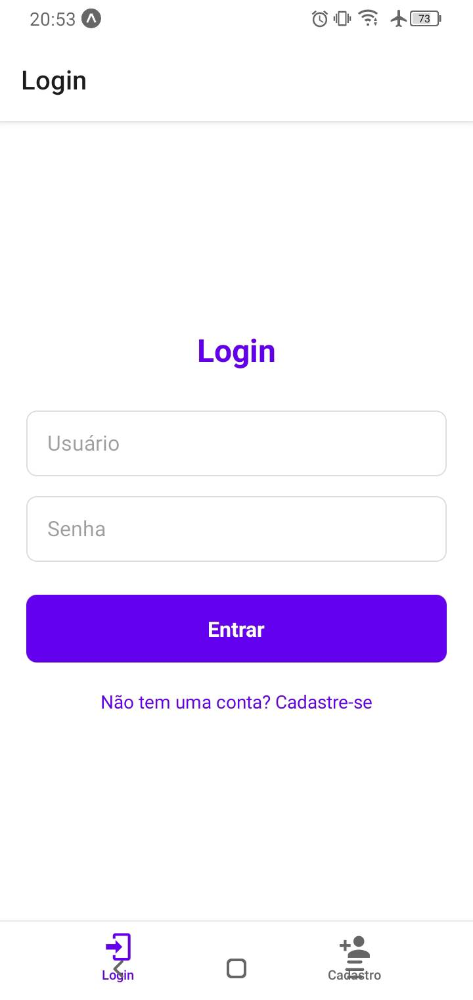
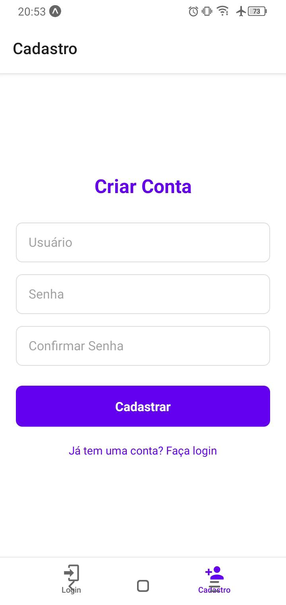
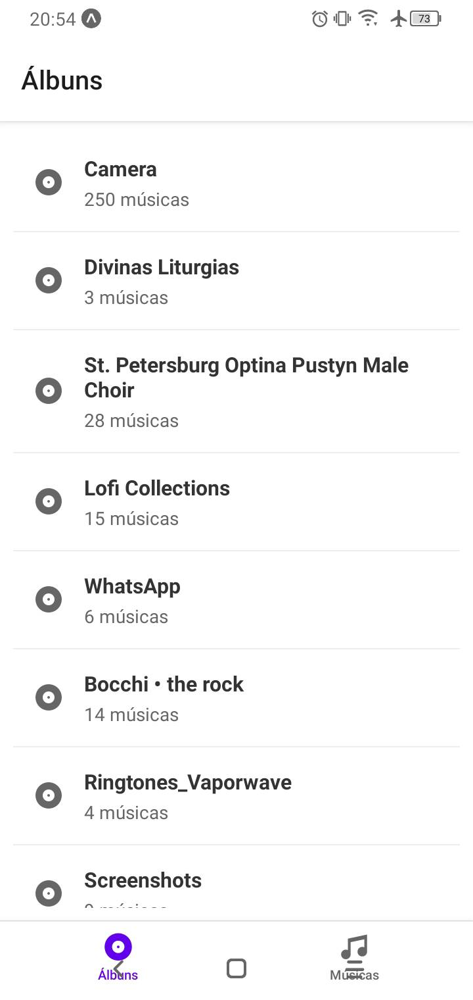
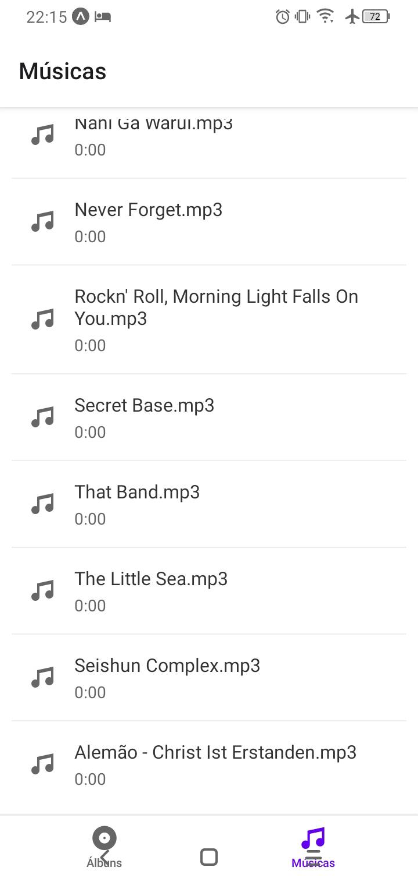
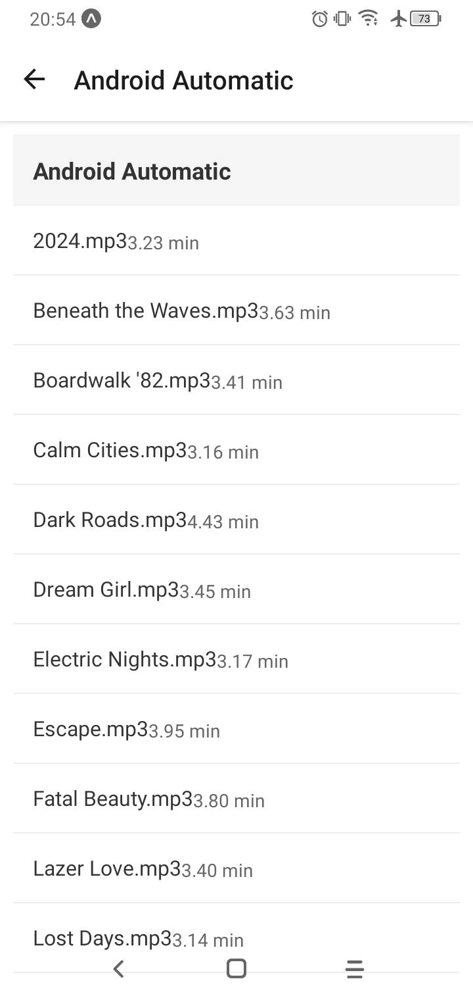
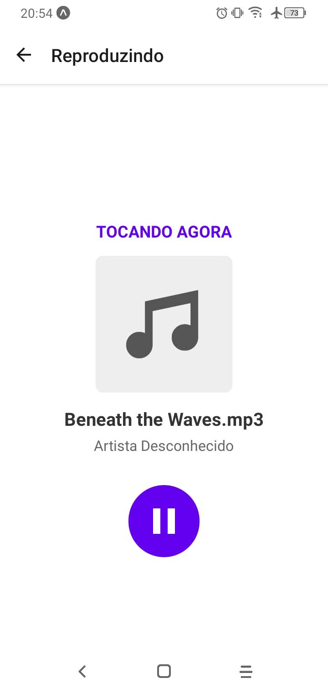

# Music Player App - React Native

## Link do Repositório

github.com/PauloGabrielLeme/Computa-o-M-vel-Player-de-M-sica

## Feito por

Paulo Gabriel Gonçalves Leme
R.A: 24.123.075-4

## Descrição

Aplicativo de música que procura os arquivos mp3 dentro do seu dispositovo móvel e os lista.
Para utilizar o aplicativo primeiro é necessário fazer uma conta local no aplicativo através da tela
de cadastro, depois inserir as credenciais cadastradas na tela de login. Após isso o usuário terá
acesso à duas telas, a com todos os arquivos mp3 do sistema, e outra que possui todas as pastas do
sistema que possuem arquivos mp3, onde o usuário pode acessar para ve os arquivos que são exclusivamente
daquela pasta.

# Telas:

Login e Cadastro . Para Acessar as músicas é necessário fazer uma conta local no aplicativo 
Playlists . Tela que lista todas as pastas do seu dispositivo que possuem um arquivo mp3
Músicas . Tela que lista todos os arquivos mp3 do seu dispositivo
Play . Tela que após o usuário selecionar uma música permite que ele comece ou pause ela.

# Prints:

## Objetivo/Porque Um Aplicativo de Música?

A idéia de fazer um aplicativo de música veio do fato de a maioria dos aplicativos na Google
Play para tocar arquivos mp3 terem anúncios excessivos e funcionalidades as quais (pessoalmente) 
acho desnecessárias.

# Dificuldades:

A maior dificuldade no desenvolvimento foi tentar implementar uma barra com o tempo da música para controle,
muito tempo foi gasto tentando implementar essas funcionalidade, e depois de feita uma pesquisa, houve a descoberta
que a funcionalidade de slider do react native não possui suporte ao Expo Go, então foi deixada de fora. Outra dificuldade,
mas, menor, foram as notificações, pois quando qualquer música era tocada uma vez, disparava infinitamente várias notificações, 
felizmente isso foi consertado com uma verificações simple,s se a notificação já foi disparada isso fica salvo para que o programa
não as dispare mais de uma vez para a mesma música.
